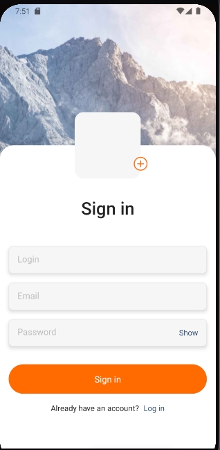
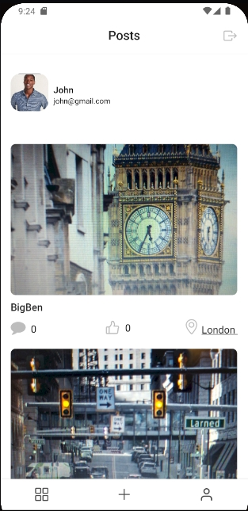
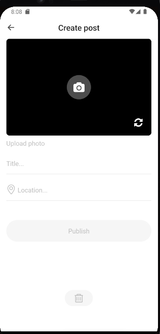
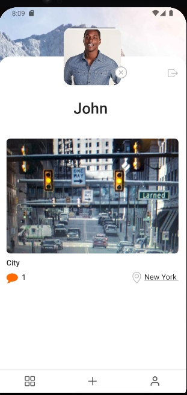

#  Blog App for Android

Welcome to Awesome Blog

Built with React Navite

## 🌐 Live Link

Check out the version here: [Blog-App](https://expo.dev/@ruslan_b/react-native-blog)

## 🛠️ Technologies

- React Navite 
- Expo
- React Navigation
- Redux Toolkit
- Firebase (Authentication, Storage, Cloud Firestore )

### Sign up Screen
- You need to register to enter your profile: nickname, email, password and add a profile photo (optional)

### Posts Screen
- Here are posts all users
- By clicking on the comments icon, you can go to the comments screen.
- Here is a photo of the post and comments from all users. You can write a comment
- When you click on the location icon, you can go to the map screen with the location label
- You can rate the post by clicking on the like icon
- There is a logout button

### Create Posts Screen
- You will be asked to grant permission to access the camera and geolocation.
- There is a camera with the possibility to change it to a front camera
- After the photo is created, you need to write the title and the name of the location. You can publish a post

### Profile Screen
- Here are your posts. On this screen, you can delete or change your avatar, exit the application

